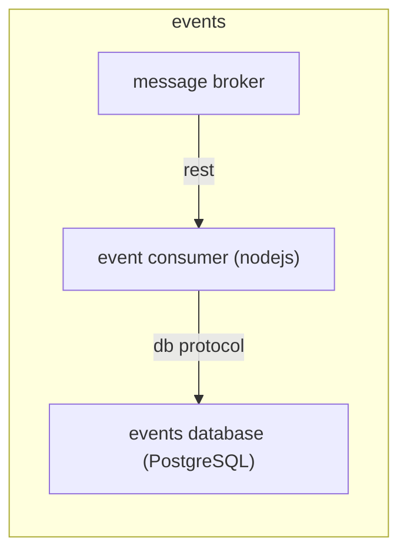
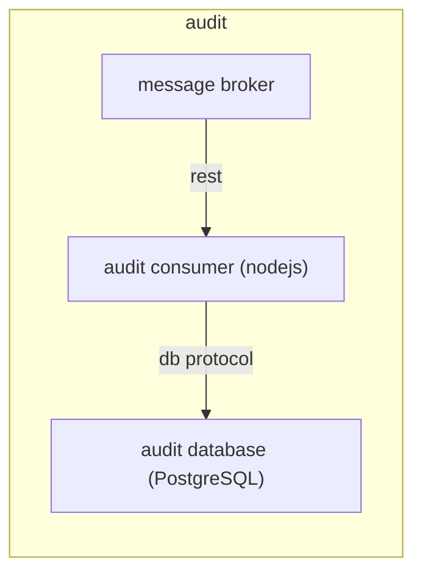
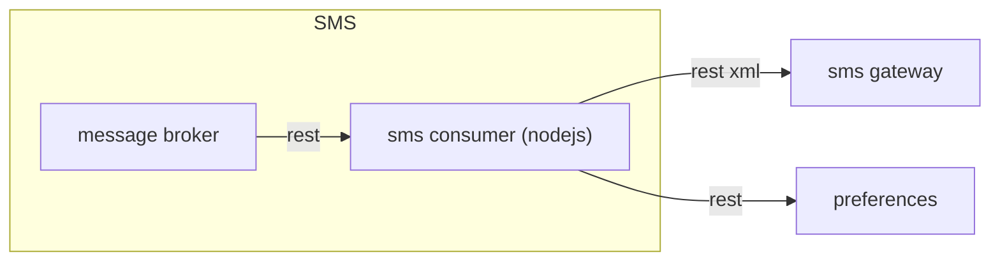
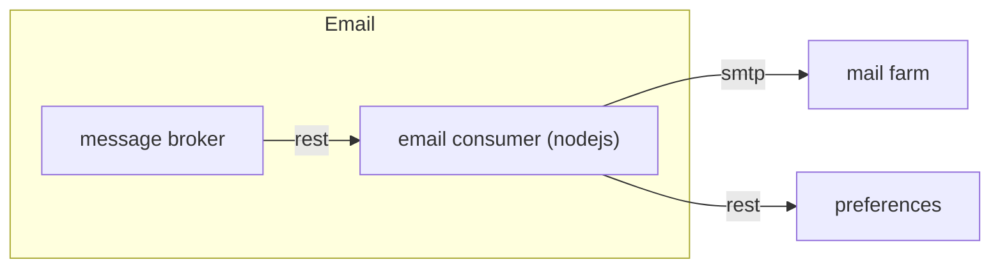
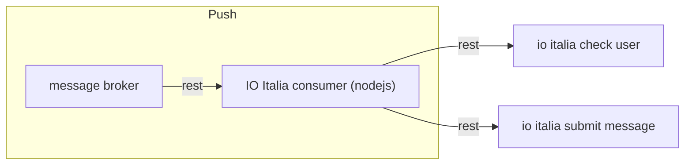
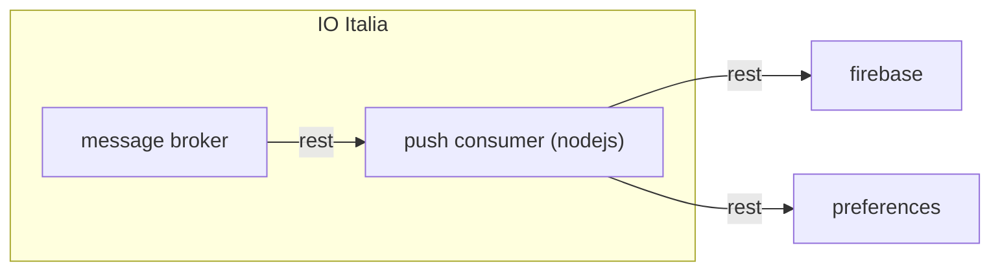
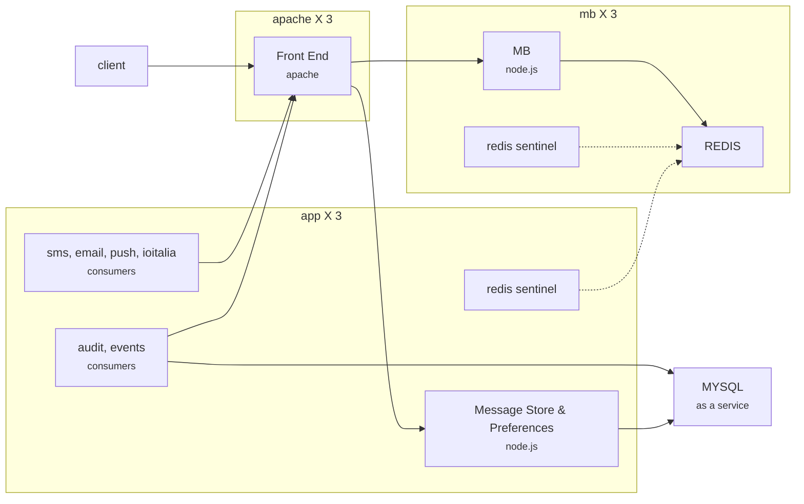

# Piattaforma di notifica regionale  
NOTIFY é una piattaforma di notifica messaggi utente dispiegata che abilita le comunicazioni delle pubbliche amministrazioni locali verso i cittadini (o in generale gli utenti finali del sistema PA).
La piattaforma favorisce l’interazione su canalità tradizionali quali email, sms e di nuova generazione ad esempio push-notification su Mobile App ed il sistema [IO Italia](https://teamdigitale.github.io/digital-citizenship/introduzione.html). 

## Componenti di piattaforma
La piattaforma si articola nelle seguenti componenti che sono state progettate per consentire un'esperienza d'uso ottimizzata per i servizi applicativi che aderiscono ad NOTIFY.

</br>

| Notificatore [NOTIFY]                                    | Preferences [P]                                                                         | Message Store [MS]                          |
|-------------------------------------------------|-----------------------------------------------------------------------------------------|---------------------------------------------|
| Motore per la gestione delle notifiche messaggi | Contatti digitali dell'utente e preferenze di notifica per singolo servizio applicativo | Archivio delle notifiche personali ricevute |

## Disegno architetturale

### Collaborazione tra sistemi


### Notify


### Message Broker
Il Message Broker si occupa di instradare i messaggi tra i vari componenti del sistema. Implementa il pattern del Virtual Topic.
L'uso di un Message Broker consente una interazione asincrona tra il sistema e i suoi client garantendo quindi una affidabilità migliore e tempi di risposta più brevi.
Dal punto di vista logico si è implementato il pattern del Virtual Topic. Questo consente mantenere la semantica *"ogni messaggio è consumato esattamente una volta"* indipendentemente dal numero di consumatori.


### Preferences
Questo modulo si occupa di gestire i contatti digitali dei cittadini e le relative preferenze di notifica.
E' costituito da un database PostgreSQL che memorizza i dati di business e da un applicativo scritto in node.js che espone l'archivio sottoforma di API Rest. La sicurezza è gestita tramite token JWT. 
La parte applicativa può essere configurata per tracciare su un topic del Message Broker eventi relativi alle attività del sistema (*events*) e, indipendentemente, le attività dell'utente (*audit*).
Il database è popolato da procedure offline oppure tramite le opportune API.


### Message Store
Questo modulo si occupa di gestire messaggi degli utenti.
E' costituito da un database MYSQL che memorizza i messaggi e da un applicativo scritto in node.js che espone l'archivio sottoforma di API Rest. La sicurezza è gestita tramite token JWT. 
La parte applicativa può essere configurata per tracciare su un topic del Message Broker eventi relativi alle attività del sistema (*events*) e, indipendentemente, le attività dell'utente (*audit*).
Il sistema è popolato dal corrispondente consumatore che scoda i messaggi presenti sul Message Broker. L'utente può eseguire un determinato set di tipi di ricerche ed impostare la data in cui è stato letto ogni messaggio.


### Events  Consumer
Questo modulo ha il compito di tracciare le attività dei componenti del sistema. E' costituito da un database PostgreSQL che contiene i record corrispondenti alle attività del componente (ad esempio: "letto messaggio dal topic", "errore di accesso al database", "messaggio correttamente inoltrato", ...) e da un consumer che si occupa di inserire sul database le informazioni dedotte dagli eventi generati dai vari componenti.



### Audit Consumer
Questo modulo ha il compito di tracciare le attività degli utenti. E' costituito da un database PostgreSQL che contiene i record corrispondenti alle attività dell'utente (ad esempio: "invocato GET su url xyz") e da un consumer che si occupa di inserire sul database le informazioni dedotte dagli eventi generati dai vari componenti.


### SMS Consumer
E' il consumatore relativo agli SMS. E' collegato alla relativa coda sul Message Broker da cui estrae i messaggi. Per ogni messaggio, tramite le opportune API, accede al modulo delle preferenze per ottenere il numero di telefono a cui inviare l'SMS. Ottenuta questa informazione confeziona la chiama all'SMS Gateway che si occuperà del delivery vero e proprio.


### Email Consumer
E' il consumatore relativo alle email. E' collegato alla relativa coda sul Message Broker da cui estrae i messaggi. Per ogni messaggio, tramite le opportune API, accede al modulo delle preferenze per ottenere l'indirizzo a cui inviare l'email. Ottenuta questa informazione confeziona la chiama alla Mail Farm che si occuperà del delivery vero e proprio.



### IO Italia Consumer
E' il consumatore relativo alla piattaforma dell'amministrazione centrale **IO Italia**. E' collegato alla relativa coda sul Message Broker da cui estrae i messaggi. Per ogni messaggio, tramite una API dedicata di IO Italia si verifica l'abilitazione concessa dall'utente (identificato con codice fiscale) per lo specifico servizio di business, se l'esito della verifica è positivo IO Italia Consumer sottomette il messaggio ad IO Italia richiamando una specifica API Rest esposta da IO Italia.


### Push Consumer
E' il consumatore relativo alle notifiche push. E' collegato alla relativa coda sul Message Broker da cui estrae i messaggi. Per ogni messaggio, tramite le opportune API, accede al modulo delle preferenze per ottenere i token necessari ad inviare le notifiche ai dispositivi registrati dall'utente. Ottenuta questa informazione confeziona la chiama a Firebase che si occuperà del delivery vero e proprio.


  
## Scelte tecnologiche
Qui sono descritte le componenti tecnologiche scelte con le relative motivazioni. 
### API REST
E' necessario introdurre uno standard per far comunicare UNP con gli altri sistemi. Tale standard deve essere di semplice implementazione e ampiamente usato.
Si è scelto API Rest in virtù delle seguenti considerazioni:
* Limitato accoppiamento tra client e server rispetto a più tradizionali protocolli RPC
* Facilità nell'estendere le API senza dover necessariamente informare i client.
* Grande diffusione (quasi tutte le applicazioni su Internet usano questo approccio)
* Essendo stateless è molto più semplice costruire sistemi scalabili.
* E' nativamente supportato dai browser rendendo l'implementazione di client molto più semplice
* E' più semplice da apprendere rispetto agli altri standard

### PostgreSQL 
Il sistema da costruire ha la necessità di memorizzare delle informazioni sui cittadini (contatti e messaggi) e operative (l'audit e il logging). E' pertanto necessario un prodotto per organizzare i dati.
La scelta di PostgreSQL è stata dettata dalle seguenti considerazioni:
* Ha performance elevate nei casi d'uso previsti
* E' pienamente supportato dal produttore
* E' molto semplice trovare documentazione ed esempi

### Firebase
Uno dei requisiti più forti della piattaforma è quello di poter inviare notifiche push su client relativamente moderni come gli smartphone.
La scelta di Firebase è data dalle seguenti considerazioni:
* E' lo standard di fatto per l'invio di notifiche su piattaforme Android, IOS, e web
* Supporta le PWA
* Non richiede pagamento
* E' supportato dal gestore ed è facile trovare documentazione ed esempi.
* Le alternative non supportano la stessa varietà di device target.
* E' una struttura distribuita e robusta che ha dimostrato di essere in grado di consegnare miliardi di notifiche al giorno
* I tempi di consegna sono, normalmente, limitati a pochissimi secondi.

### Redis
Per migliorare disponibilità e affidabilità si è scelto di usare un message broker. Sono richieste scalabilità e performance. Non è invece richiesta la memorizzazione di grandi quantità di dati. La scelta di Redis per questo ruolo è dovuta alle seguenti considerazioni:
* Performance elevatissime
* Possibilità di usarlo come database e come cache
* Semplicità di utilizzo
* Pieno supporto alla logica di *Publish/Subscribe*
* Semplicità di installazione
* Supporto nativo a clustering e replication
* Supporto alla transazionalità
* Open Source, documentazione ben fatta ed esempi semplici da trovare

### Node.js
Occorre un prodotto che consenta di implemente le funzionalità del sistema.
La scelta è ricaduta su node.js per i seguenti motivi:
* Runtime leggero
* Open Source, documentazione ben fatta ed esempi semplici da trovare
* Modello di concorrenza semplice
* Ottimizzato per operazioni di I/O
* Ampiamente usato in ambito business
* Disponibilità di librerie open source per tutti i task significativi che devono essere affrontati
* Il ciclo di sviluppo-test è molto rapido
* Supporto al paradigma di programmazione funzionale
* Gestore delle dipendenze integrato

### JWT
Vi è un forte requisito di rendere il sistema sicuro e di poter tracciare le operazioni svolte dai client. La scelta sui token JWT è dovuta a:
* Semplicità di implementazione 
* esistono molte librerie open source che implementano lo standard.
* Salvaguarda il principio *stateless* dello stile architetturale rest 
* E' molto flessibile in quanto può portare qualsiasi tipo di informazione.
* Il fatto di essere firmato garantisce il fatto che sia molto difficile da falsificare
* E' di fatto uno standard in molti scenari

## Deployment

Il diagramma seguente è lo schema di deployment del sistema.



# Rilascio chiavi di accesso JWT alla piattaforma
Il sistema ha la necessità di controllare e  tracciare le attività dei client che lo usano la piattaforma di notifica. Per soddisfare questi requisiti ad ogni client è assegnato un token JWT che include le informazioni necessarie per svolgere tutte le funzioni richieste. Tale token, la cui conservazione e riservatezza sono a cura del client, è rilasciato al fruitore all'atto della sottoscrizione al servizio NOTIFY.

## Processo per il rilascio di un token al client
Il token contiene le informazioni necessarie affinchè il sistema possa inviare le notifiche per conto del client.  Ove le informazioni fornite debbano essere cambiate, ad esempio perchè si vuole dismettere una canalità o sono cambiate le credenziali per le emai,l deve essere rilasciato un nuovo token. La prassi richiede che sia rilasciato un token differente per ogni modulo che con cui è necessario interfacciarsi. Ad esempio un client complesso potrebbe disporre di un token per inviare le notifiche, uno per usare le preferenze e uno per usare il message store.

## Registrazione del servizio di business
  Il servizio di business in fase di registrazione deve fornire le seguenti informazioni:                                                                                                                                               

| **nome**              | **descrizione**                                                                                                                                                                                                                                                                                               |
|-----------------------|---------------------------------------------------------------------------------------------------------------------------------------------------------------------------------------------------------------------------------------------------------------------------------------------------------------|
| service name          | identificativo univoco del servizio ( se disponibile utilizzare un identificativo già presente nell'ecosistema di riferimento)                                                                                                                                                                                                                                               |
| reference_email       | email di contatto del capo progetto del servizio, questa informazione verrà utilizzata esclusivamente per l'invio di token di accesso o altre informazioni di servizio.                                                                                                                                                                                                                                                                  |
| tags                  | attributi del servizio utili come filtri in fase presentazione all'utente dei servizi di notifica. Consigliato un confronto con il gruppo di Governo per l'attribuzione dei tags al servizio                                                                                                                                                                                                                                             |
| canalità offerte  | Specificare le canalità offerte dal servizio di business: email, sms, push.<br>N.B.:<br>  Nel caso di **push** è necessario esplicitare la chiave token di FireBase legata all'applicazione web che riceve le notifiche. Da richiedere al progettista responsabile dello sviluppo del front-end.<br> Nel caso di **sms** è necessario indicare gli estremi del progetto SMS (a cura del referente di progetto CSI)<br>  Nel caso di **email** è necessario indicare una mail mittente valida e registrata presso il provider. esempio mail: "Sportello Facile" \<sportellofacile@torinofacile.it\> Se il gestore del servizio di posta è CSI-Piemonte è necessario che l'indirizzo sia correttamente censito. Se il gestore del servizio di posta non è il CSI-Piemonte è necessario che il gestore esterno aggiunga al loro record SPF sul DNS i server CSI di uscita "include:_spfmailfarmnet.csi.it", questa condizione è necessaria affinchè le mail siano correttamente recapitate all'utente. La dimensione del messaggio di posta influisce suoi tempi di evasione dei messaggi a causa del tempo di calcolo della firma DKIM, si prega di minimizzare la grafica e il testo dei messaggi.|                                                                                                                                                                                                               |

Ad ogni servizio di business è associata una chiave JWT di accesso alle API di sottomissione notifiche e le chiavi JWT dei canalità di front-end responsabili del setting delle preferenze utente e consultazione messaggi.

Per il rilascio dei token di accesso contattare il referente CSI della piattaforma di notifica.

  
# Getting started submit notifiche
Il sistema di notifica si basa su un message broker che indirizza ai vari canali le notifiche.
Per contattare il *Message Broker* è necessario disporre di un token di autorizzazione rilasciato durante il processo di accreditamento al notificatore ed associato al singolo servizio di business. 
Ogni richiesta inviata deve avere l'header ```x-authentication```  valorizzato con il token.

Parte integrante della piattaforma di notifica e la componente  *Preferences* che detiene i contatti digitali dell'utente e preferenze per singolo servizio. Il comportamento di default del notificatore prevede che il messaggio venga recapitato al cittadino rispettando le preferenze dell'utente stesso. Se l'utente **non ha attivato le preferenze**, il sistema di business può inviare un messaggio all'utente esplicitando il contatto digitale nel messaggio stesso.

Il sistema di business ha inoltre la facoltà di invertire il comportamento di default ("trusted":true) dando priorità al contatto esplicitato del messaggio, in questo scenario il sistema di notifica non tiene conto della preferenza dell'utente. L'utilizzo di questa feature è concessa esclusivamente ai sistemi di business che detengono preferenze utente esterne al sistema centrale *Preferences*.

La piattaforma di notifica NOTIFY è in grado di veicolare un messaggio di notifica alla piattaforma dell'amministrazione centrale IO Italia, affinché un messaggio possa essere recapitato ad IO Italia è necessario che l'utente destinatario del messaggio si sia accreditato al sistema centrale e che non abbia negato la ricezione delle notifiche per lo specifico servizio.

Il sistema gestisce una semplice forma di priorità. Essa consiste dare la precedenza ai messaggi con l'attributo ```priority``` impostato al valore "high". I messaggi a medesima priorità sono comunque serviti secondo la politica FIFO. 


## Descrizione campi messaggi di notifica
  
* ```uuid```: codice uuid del messaggio. E' una stringa in formato UUIDv4, è responsabilità del client che sottomette la notifica generare la chiave. Identifica il messaggio del message broker.
* ```expire_at```: data di scadenza del messaggio in ISO 8601 (i.e 2019-05-02T14:00:00)
* ```priority```: se valorizzato con ```high``` (stringa)  il messaggio sarà gestito dalle code con un tasso di consegna il più elevato possibile, trattandosi di notifiche di cortesia non sono previsti tempi minima di consegna.   
* ```payload```: contiene il payload del messaggio. Nel caso particolare dell'invio delle notifiche contiene principalmente le informazioni per le notifiche sui vari canali.
   * ```payload.id```: id della notifica da inviare.  E' una stringa in formato UUIDv4 è responsabilità del client che sottomette la notifica generare la chiave. Identifica la notifica e sarà usato per memorizzare il messaggio nel *Message Store* come comunicazione disponibile sul portale di accesso dell'utente.
   * ```payload.bulk_id```: uuid che rappresenta un bulk(collezione) di messaggi
   * ```payload.correlation_id```: uuid di un messaggio correlato
   * ```payload.user_id```: user_id del destinatario. E' una stringa (spesso il codice fiscale) che identifica l'utente a cui inviare la notifica. E' usato per consultare il sistema *Preferences* per ricavare i contatti digitali.  
   * ```payload.tag```: elenco dei tags associati alla comunicazione, l'elenco dei tag ammissibili è governato dall'ecosistema dell'ente.     
   * ```payload.push```: Sezione dedicata alla notifica push. Contiene le informazioni necessarie per inviare tramite firebase la notifica push. E' necessario che i token che identifichino i dispositivi dell'utente siano memorizzati nei contatti digitali in *Preferences*.    
        *  ```payload.push.token```: RISERVATO PER L'UTILIZZO IN LEGACY O TRUSTED. Un array di stringhe che rappresentano i token utenti.
        *  ```payload.push.title```: contiene la stringa che sarà visualizzata come titolo della notifica.
         * ```payload.push.body```: contiene la stringa che sarà visualizzata come corpo della notifica.
         * ```payload.push.call_to_action```: stringa che sarà interpretata dal client per indirizzare l'esecuzione a fronte dell'interazione dell'utente con la notifica visualizzata sul dispositivo. Tipicamente è l'uri di una pagina dell'applicazione dell'utente (app PWA, portale web).
   * ```payload.sms```: Sezione dedicata alla notifica via SMS. Contiene le informazioni necessarie per inviare l'SMS tramite il gateway SMS.
      * ```payload.sms.phone```: RISERVATO PER L'UTILIZZO IN LEGACY O TRUSTED. Stringa contente il numero di telefono del destinatario.
      * ```payload.sms.content```: E' il contenuto del messaggio SMS da inviare all'utente, il numero massimo di caratteri ammessi è 159. Il testo deve matchare la regex: ```/^[a-zA-Z0-9àèìòùÀÈÌÒÙáéíóúÁÉÍÓÚ"!\s()=?'+*@$%,.;:#_\->/]*$/g```
              Ci sono delle eccezioni riguardo il conteggio dei caratteri.
              1) Il carattere “:” viene conteggiato due volte quando è seguito da un altro carattere “:”, oppure quando è
					seguito da due cifre esadecimali. Alcuni esempi:
					“Ore 16:30” (vengono contati 10 caratteri, e non 9)
					“Colore::rosso Altezza::150cm” (vengono contati 31 caratteri e non 28)
					“Sede museo: piazza Carignano” (vengono contati 28 caratteri, quanti ne contiene il testo,
					in quanto il carattere “:” non è seguito da altri caratteri “:” o da coppia di cifre esadecimali)
			2) Tutti i caratteri accentati contano come due caratteri. Per esempio:
			“perché andrò” (per il Gateway SMS ha una lunghezza pari a 14 invece che 12 caratteri)
   * ```payload.email```:  Sezione dedicata alla notifica via email. Contiene le informazioni necessarie per inviare una email tramite la mailfarm.
      *  ```payload.email.to```: RISERVATO PER L'UTILIZZO IN LEGACY O TRUSTED. Email destinatario.
      *  ```payload.email.subject```: La stringa usata come subject della email.
      * ```payload.email.body```: La stringa in formato HTML da usare per comporre il body della email in linea con il template associato alla comunicazione email.
      * ```payload.email.template_id```: identificativo del template da usare per inviare email.
   * ```payload.mex```: Sezione dedicata alla memorizzazione sul componente *Message Store* (aka *Comunicazioni* nel contesto di Città di Torino). Se la sezione è valorizzata la memorizzazione avviene indipendentemente dalla presenza di contatti digitali memorizzati su *Preferences*.
      * ```payload.mex.title```: La stringa che rappresenta il titolo della comunicazione
      * ```payload.mex.body```: La stringa che rappresenta il contenuto della comunicazione
      * ```payload.mex.call_to_action```: stringa che sarà interpretata dal client per indirizzare l'esecuzione a fronte dell'interazione dell'utente con la comunicazione. Tipicamente è l'uri di una pagina dell'applicazione dell'utente (app PWA, portale web).
    * ```payload.io```: informazione utili per l'invio di notifiche al progetto IO Italia (https://io.italia.it/), per la formattazione del dell'oggetto fare riferimento a: https://dev-portal-prod.azurewebsites.net/openapi.html
    * ```payload.io.time_to_live```: Default:3600. Specifica quanto tempo(in secondi) il messaggio vivrà nel sistema di io prima che venga scartato perché scaduto.
    * ```payload.io.content```: contenuto della notifica (required)
	    * ```payload.io.content.subject```: Il soggetto del messaggio (10-120 caratteri)
	    * ```payload.io.content.markdown```: il test del messaggio in markdown (80-10000)
	    * ```payload.io.content.payment_data```:  parte opzionale che indica la sezione per il pagamento PagoPA
			* ```payload.io.content.payment_data.amount```:  Quantità espressa in centesimi di euro (1-999999999)
		    * ```payload.io.payment_data.notice_number```: il campo "numero_avviso" di PagoPA. (```^[0123][0-9]{17}$```)
		* ```payload.io.content.due_date```:  ISO-8601 format and UTC timezone. (i.e. 2019-05-29T20:00:00)
	* ```payload.io.default_addresses```: Indirizzi di default nel caso l'utente non l'abbia settati 
		* ```payload.io.default_addresses.email```: email addresses 
   * ```payload.memo```:  sezione dedicata alla generazione di eventi Calendario in formato .ics Standard	RFC 5545
	  * ```payload.memo.start```: data inizio evento(ISO 8601) (i.e 2019-05-02T14:00:00), se è un evento allDay aggiungere anche il timezone "Z" successivamente (i.e. 2019-05-02T00:00:00Z)
	  * ```payload.memo.end```: data fine evento(ISO 8601) (i.e 2019-05-02T14:00:00)
	  * ```payload.memo.summary```:  sommario che descrive l'evento
	  * ```payload.memo.description```: descrizione estesa dell'evento
	  * ```payload.memo.location```: indirizzo dell'evento
	  * ```payload.memo.organizer```: organizzatore dell'evento (es: Torino Facile <noreply.torinofacile@csi.it>)
 * ```trusted```: se valorizzato con ```true``` (boolean) allora il sistema delle preferenze non è contattato e saranno usati i contatti digitali presenti nel messaggio. 

## Tipologie di sottomissione notifiche
### Invio di una singola notifica  
  
Per inviare una singola notifica ad un utente occorre usare il servizio di submit del *Message Broker*.
L'api da usare è situata all'endpoint ```/api/v1/topics/messages```. Usando il verbo **POST**  occorre inviare un body che contiene il messaggio con il payload che consiste nella notifica da inviare. 
#### Esempio di request per l'invio di una singola notifica in ambiente di TEST
L' endpoint con di test per sottomettere un messaggio è: 
https://<notify-server>/notify-mb/api/v1/topics/messages

```  
{
	"uuid": "67e79131-d1b4-46bb-8e7f-e69eaeb807a6",
	"expire_at": "2019-04-23T20:00:00",
    "payload": {
		"id": "df5fc799-4ebd-403f-8145-af164fd158a5",
        "user_id": "PPPPLT80R10M082K",
	  	"tag": "appuntamenti,urgente,c_l219",
	  	"push": {
					"title":"conferma appuntamento anagrafe",
					"body":"Ti ricordiamo l'appuntamento prenotato presso l'ufficio anagrafe",
					"call_to_action":"https://servizi.torinofacile.it/cgi-bin/accesso/base/index.cgi?cod_servizio=SPOT&realm=torinofacile"
		},
		"email": {
			"subject":"conferma appuntamento anagrafe",
			"body":"Ti ricordiamo l'appuntamento prenotato presso l'ufficio anagrafe per il 24 Aprile 2019 ore 09:00",
			"template_id":"template-spff.html"
		},
		"sms": {
			"content":"Ricorda l'appuntamento presso l'anagrafe di Torino per il 24 Aprile 2019 ore 09:00. per maggiori info www.torinofacile.it"
		},
		"mex": {
			"title": "conferma appuntamento anagrafe",
			"body" : "Ti ricordiamo l'appuntamento prenotato presso l'ufficio anagrafe per il 24 Aprile 2019 ore 09:00",
			"call_to_action": "https://servizi.torinofacile.it/cgi-bin/accesso/base/index.cgi?cod_servizio=SPOT&realm=torinofacile"
		},
        "io": {
            "time_to_live": 3600,
            "content": {
                "subject": "conferma appuntamento anagrafe",
                "markdown": "# memo appuntamento## presso ufficio Anagrafe di Città di TorinoTi ricordiamo l'appuntamento prenotato presso l'ufficio anagrafe per il 24 Aprile 2019 ore 09:00",
	            "due_date": "2019-04-24T00:00:00"
            }
        },
	    "memo":{
	    	"start": "2019-04-24 09:00:00",
	        "end": "2019-04-24 09:45:00",
	        "summary": "appuntamento Anagrafe Città di Torino",
	        "description": "Ti ricordiamo l'appuntamento prenotato presso l'ufficio anagrafe",
	        "location": "Via della Consolata, 23, 10122 Torino",
	        "organizer": "Torino Facile <noreply.torinofacile@csi.it>"
	    }
	}
}
 ```  
#### Esempio con curl

**call** 
```
curl -X POST \
           https://<notify-server>/notify-mb/api/v1/topics/messages \
           -H 'Content-Type: application/json' \
           -H 'x-authentication: eyJhbGciOiJIUzI1NiIsInR5cCI6IkpXVCJ9.eyJ1dWlkIjoiNGRlZjJkYzUtOGM1Ny00NDE5LTg1MGYtOTg4ZjhkN2QzNWQwIiwiY2xpZW50X25hbWUiOiJhcHByZWZlcnRpIiwiY2xpZW50X3V1aWQiOiIxYzIzZmUxYy0xMDhkLTQxOTQtOWM3OS1hNTU1NjVjMDYxMTYiLCJwcmVmZXJlbmNlX3NlcnZpY2VfbmFtZSI6InJvbF9udW92b19yZWZlcnRvIiwiZXhwIjoyNTM0MDIyMTA4MDAwMDAsImlhdCI6MTUxOTgyMjcwNDQzOCwiYXBwbGljYXRpb25zIjpbIm5vdGlmeSIsIm1leCIsInByZWZlcmVuY2VzIl0sInBlcm1pc3Npb25zIjpbInVzZXIiLCJhZG1pbiIsImJhY2tlbmQiXSwicHJlZmVyZW5jZXMiOnsicHVzaCI6IkFBQUFXbXhjZnpZOkFQQTkxYkhJVVo3OFJCVEhhSi1pS05PeldRdy15ODhJVDVJenhQMDFHRXd6a0VaVlV6MDNNYWstMkNIdkpXUWRDYXREeWpNVGFkSHNQS1VhMGV3ekowc2YxVEFURkFIV3h3S1o0c2FhWF8wWDhzNUdVSE0wbm1QbS0xV0tyLVdCX041Y2IySFZrVElqIiwiZW1haWwiOiJhcHByZWZlcnRvQGFzZC5jb20iLCJtZXgiOiJhc2RhZCIsInNtcyI6eyJ1c2VybmFtZSI6Im5vdGlmeSIsInBhc3N3b3JkIjoibWVnYWxvbWFuXzE4IiwicHJvamVjdF9jb2RlIjoiMzcifX19.H9Fs0IVGwK9E16F3R3cVcc-ULWw5WjTcPBgiUPGsoMU' \
           -d '{
         	"uuid" : "755df7a7-2552-46c0-932f-3cb7bec1863b",
			"payload": {
				"id": "df5fc799-4ebd-403f-8145-af164fd158a5",
				"user_id": "PPPPLT80R10M082K",
				"tag": "appuntamenti,urgente,c_l219",
				"push": {
							"title":"conferma appuntamento anagrafe",
							"body":"Ti ricordiamo l'appuntamento prenotato presso l'ufficio anagrafe",
							"call_to_action":"https://servizi.torinofacile.it/cgi-bin/accesso/base/index.cgi?cod_servizio=SPOT&realm=torinofacile"
				},
				"email": {
					"subject":"conferma appuntamento anagrafe",
					"body":"Ti ricordiamo l'appuntamento prenotato presso l'ufficio anagrafe per il 24 Aprile 2019 ore 09:00",
					"template_id":"template-spff.html"
				},
				"sms": {
					"content":"Ricorda l'appuntamento presso l'anagrafe di Torino per il 24 Aprile 2019 ore 09:00. per maggiori info www.torinofacile.it"
				},
				"mex": {
					"title": "conferma appuntamento anagrafe",
					"body" : "Ti ricordiamo l'appuntamento prenotato presso l'ufficio anagrafe per il 24 Aprile 2019 ore 09:00",
					"call_to_action": "https://servizi.torinofacile.it/cgi-bin/accesso/base/index.cgi?cod_servizio=SPOT&realm=torinofacile"
				},
				"io": {
					"time_to_live": 3600,
					"content": {
						"subject": "conferma appuntamento anagrafe",
						"markdown": "# memo appuntamento## presso ufficio Anagrafe di Città di TorinoTi ricordiamo l'appuntamento prenotato presso l'ufficio anagrafe per il 24 Aprile 2019 ore 09:00",
						"due_date": "2019-04-24T00:00:00"
					}
				},
				"memo":{
					"start": "2019-04-24 09:00:00",
					"end": "2019-04-24 09:45:00",
					"summary": "appuntamento Anagrafe Città di Torino",
					"description": "Ti ricordiamo l'appuntamento prenotato presso l'ufficio anagrafe",
					"location": "Via della Consolata, 23, 10122 Torino",
                    "organizer": "Torino Facile <noreply.torinofacile@csi.it>"
				}
			}
         
         }'
```

**response**

```
message added to the queue 'messages'
```
Far riferimento alle specifiche YAML per l'elenco dei codici di errori HTTP previsti per la sottomissione notifiche.

### Invio di un gruppo di notifiche (modalità Bulk)
  
La piattaforma NOTIFY permette la sottomissione di un gruppo di notifiche mediante il richiamo di un servizio API Rest della componente *Message Broker*.
L'api da usare è situata all'endpoint ```/api/v1/topics/messages```. Usando il verbo **POST**  occorre inviare un body che contiene un array di messaggi ognuno dei quali con il payload che consiste nella notifica da inviare.
La dimensione massima del payload sottomesso via API Rest è di 20 MByte, oltre questa dimensione il messaggio non viene preso in carico dal Message Broker. E' possibile suddividere gruppi di notifiche di dimensioni maggiori di 20 MByte in più chiamate, ciascuna con una payload massimo di 20 MByte, oltre questa dimensione il bulk sarà rifiutato dal sistema.

#### Esempio di request per invio a gruppi di notifiche
Qui sotto una request che invia una notifica ad ognuno dei tre utenti. I contenuti sono personalizzati per ogni utente. La request è un array di messaggi che hanno esattamente lo stesso formato del caso in cui si invii una singolo messaggio.
Si aggiunge il campo ```bulk_id ``` che identifica il gruppo di appartenenza del messaggio (non mandatorio).  E' utile nel caso in cui si voglia rintracciare il flusso esecutivo dei messaggi inviati in gruppo. E' opportuno che il valore sia lo stesso per ogni messaggio.

```  
[
	{
	"uuid": "db2b5681-87af-4bff-95ed-b1b22f4c2f2d",
	"expire_at": "2019-04-23T20:00:00",
	"bulk_id": "fbede27f-3dc1-4b73-8d8a-c452b8f377ec",
    "payload": {
		"id": "db2b5681-87af-4bff-95ed-b1b22f4c2f2d",
        "user_id": "PPPPLT80R10M082K",
	  	"tag": "appuntamenti,urgente,c_l219",
	  	"push": {
					"title":"conferma appuntamento anagrafe",
					"body":"Ti ricordiamo l'appuntamento prenotato presso l'ufficio anagrafe",
					"call_to_action":"https://servizi.torinofacile.it/cgi-bin/accesso/base/index.cgi?cod_servizio=SPOT&realm=torinofacile"
		},
		"email": {
			"subject":"conferma appuntamento anagrafe",
			"body":"Ti ricordiamo l'appuntamento prenotato presso l'ufficio anagrafe per il 24 Aprile 2019 ore 09:00",
			"template_id":"template-spff.html"
		},
		"sms": {
			"content":"Ricorda l'appuntamento presso l'anagrafe di Torino per il 24 Aprile 2019 ore 09:00. per maggiori info www.torinofacile.it"
		},
		"mex": {
			"title": "conferma appuntamento anagrafe",
			"body" : "Ti ricordiamo l'appuntamento prenotato presso l'ufficio anagrafe per il 24 Aprile 2019 ore 09:00",
			"call_to_action": "https://servizi.torinofacile.it/cgi-bin/accesso/base/index.cgi?cod_servizio=SPOT&realm=torinofacile"
		},
        "io": {
            "time_to_live": 3600,
            "content": {
                "subject": "conferma appuntamento anagrafe",
                "markdown": "# memo appuntamento## presso ufficio Anagrafe di Città di TorinoTi ricordiamo l'appuntamento prenotato presso l'ufficio anagrafe per il 24 Aprile 2019 ore 09:00",
	            "due_date": "2019-04-24T00:00:00"
            }
        },
	    "memo":{
	    	"start": "2019-04-24 09:00:00",
	        "end": "2019-04-24 09:45:00",
	        "summary": "appuntamento Anagrafe Città di Torino",
	        "description": "Ti ricordiamo l'appuntamento prenotato presso l'ufficio anagrafe",
	        "location": "Via della Consolata, 23, 10122 Torino",
	        "organizer": "Torino Facile <noreply.torinofacile@csi.it>"
	    }
	}
},
	{
		"uuid": "d7255707-dd47-4d49-8189-f795a2c1a542",
	    "payload": {
			"id": "d7255707-dd47-4d49-8189-f795a2c1a542",
			"bulk_id":"fbede27f-3dc1-4b73-8d8a-c452b8f377ec",
	        "user_id": "CNZCNE92R10R082Z",
		  	"push": {
						"title":"Titolo push 2",
						"body":" corpo push 2",
						"call_to_action":"https://servizi.torinofacile.it/cgi-bin/accesso/base/index.cgi?cod_servizio=SPOT&realm=torinofacile"
			},
			"email": {
				"subject":"subject email 2",
				"body":" corpo del messaggio HTML",
				"template_id":"default-template.html"
			},
			"sms": {
				"content":"corpo sms 2"
			},
			"mex": {
				"title": "titolo mex 2",
				"body" : " corpo mex 2",
				"call_to_action": "https://servizi.torinofacile.it/cgi-bin/accesso/base/index.cgi?cod_servizio=SPOT&realm=torinofacile"
			}
		}
	},
	{
	"uuid": "b04581a8-6a39-4b86-99f9-336940a60ebf",
	"expire_at": "2019-04-23T20:00:00",
    "payload": {
		"id": "b04581a8-6a39-4b86-99f9-336940a60ebf",
		"bulk_id":"fbede27f-3dc1-4b73-8d8a-c452b8f377ec",
        "user_id": "TTTSRN81R10M082G",
	  	"tag": "appuntamenti,urgente,c_l219",
	  	"push": {
					"title":"conferma appuntamento anagrafe",
					"body":"Ti ricordiamo l'appuntamento prenotato presso l'ufficio anagrafe",
					"call_to_action":"https://servizi.torinofacile.it/cgi-bin/accesso/base/index.cgi?cod_servizio=SPOT&realm=torinofacile"
		},
		"email": {
			"subject":"conferma appuntamento anagrafe",
			"body":"Ti ricordiamo l'appuntamento prenotato presso l'ufficio anagrafe per il 24 Aprile 2019 ore 09:00",
			"template_id":"template-spff.html"
		},
		"sms": {
			"content":"Ricorda l'appuntamento presso l'anagrafe di Torino per il 24 Aprile 2019 ore 09:00. per maggiori info www.torinofacile.it"
		},
		"mex": {
			"title": "conferma appuntamento anagrafe",
			"body" : "Ti ricordiamo l'appuntamento prenotato presso l'ufficio anagrafe per il 24 Aprile 2019 ore 09:00",
			"call_to_action": "https://servizi.torinofacile.it/cgi-bin/accesso/base/index.cgi?cod_servizio=SPOT&realm=torinofacile"
		},
        "io": {
            "time_to_live": 3600,
            "content": {
                "subject": "conferma appuntamento anagrafe",
                "markdown": "# memo appuntamento## presso ufficio Anagrafe di Città di TorinoTi ricordiamo l'appuntamento prenotato presso l'ufficio anagrafe per il 24 Aprile 2019 ore 09:00",
	            "due_date": "2019-04-24T00:00:00"
            }
        },
	    "memo":{
	    	"start": "2019-04-24 09:00:00",
	        "end": "2019-04-24 09:45:00",
	        "summary": "appuntamento Anagrafe Città di Torino",
	        "description": "Ti ricordiamo l'appuntamento prenotato presso l'ufficio anagrafe",
	        "location": "Via della Consolata, 23, 10122 Torino",
	        "organizer": "Torino Facile <noreply.torinofacile@csi.it>"
	    }
	}
}
]
 ```  
### Invio di notifica trusted
Per inviare una singola notifica trusted (ovvero per fare in modo che il sistema non si appoggi a *Preferenze*) ad un utente occorre usare il servizio di submit del *Message Broker*.
L'api da usare è situata all'endpoint ```/api/v1/topics/messages```. Usando il verbo **POST**  occorre inviare un body che contiene il messaggio con il payload che consiste nella notifica da inviare. In questo caso occorre aggiungere un campo ```trusted``` valorizzato con ```true```.
Da notare che non ha senso l'invio di notifiche di questo tipo via push o sul messagestore.
Si consiglia di usare questo tipo di notifica per inviare un messaggio su un singolo canale.

##### Esempio di notifica trusted (email)
```  
{
	"uuid": "67e79131-d1b4-46bb-8e7f-e69eaeb807a6",
    "payload": {
		"id": "df5fc799-4ebd-403f-8145-af164fd158a5",
        "user_id": "DGNDRN",
		"email": {
			"to":"pippo@gmail.com",
			"subject":"Preferenza di notifica: conferma indirizzo email",
			"body":"Ciao, per validare il tuo indirizzo email copia il codice ABC123 sul sistema di validazione contatti.",
			"template_id":"default-template.html"
		},
		"trusted":true
	}
}
 ```  

##### Esempio di notifica trusted (sms)
```  
{
	"uuid": "67e79131-d1b4-46bb-8e7f-e69eaeb807a6",
    "payload": {
		"id": "df5fc799-4ebd-403f-8145-af164fd158a5",
        "user_id": "DGNDRN",
		"sms": {
			"phone":"00393341190012",
			"content": "Il codice di conferma contatto è ABC123"
		},
		"trusted":true
	}
}
 ```  
### Contesto di utilizzo della componente *Preferences*
Il sistema di preferenze del cittadino contiene principalmente i contatti digitali dello stesso e le associazioni tra canale di comunicazione e servizio.
Per contattare *Preferences* è necessario avere un token di autorizzazione che è rilasciato durante il processo di accreditamento.
Ogni richiesta inviata deve avere l'header ```x-authentication```  valorizzato con il token.

#### Lettura dei contatti digitali  
  
Per ricavare i contatti digitali di un cittadino occorre invocare l'endpoint ```/api/v1/users/{user_id}/contacts``` usando il verbo **GET**.

Ad esempio invocando con **GET** ```/api/v1/users/MNVPNT77S11L219F/contacts```

Si otterrà un risultato simile a questo:
```
{
    "user_id": "MNVPNT77S11L219F",
    "sms": "0039333312412",
    "email": "mario.rossi@email.com",
    "push": {
              "prof_citt":
                  ["dkMBmrbsNZg:APA91bHfP22izgJnhfjjmfIW8qa8Fe0BRekZ-W9i4ztiNdmYHQhc4K9htgRQu8PZSI7JiM5RnV4QGxuZLSUsxeJWhKqj77guPwhgnQJM2QKMutO9RgUxucpXBsfthAh4QrLX2X5yNRnb",
                  "dkMBmrbsNZg:APA91bHfP22izgJnhfjjmfIW8qa8Fe0BRekZ-W9i4ztiNdmYHQhc4K9htgRQu8PZSI7JiM5RnV4QGxuZLSUsxeJWhKqj77guPwhgnQJM2QKMutO9RgUxucpXBsfthAh4QrLX2X5yN333"
                  ]
    } ,

}
```

#### Salvataggio dei contatti digitali
Per impostare i contatti digitali di un cittadino occorre invocare l'endpoint ```/api/v1/users/{user_id}/contacts``` usando il verbo **PUT**. Il body della request deve contenere un json con i contatti digitali.

Ad esempio invocando con **PUT** ```/api/v1/users/MNVPNT77S11L219F/contacts``` con body

```
{
    "sms": "0039333312412",
    "email": "mario.rossi@email.com",
    "push": {
              "prof_citt":
                  ["dkMBmrbsNZg:APA91bHfP22izgJnhfjjmfIW8qa8Fe0BRekZ-W9i4ztiNdmYHQhc4K9htgRQu8PZSI7JiM5RnV4QGxuZLSUsxeJWhKqj77guPwhgnQJM2QKMutO9RgUxucpXBsfthAh4QrLX2X5yNRnb",
                  "dkMBmrbsNZg:APA91bHfP22izgJnhfjjmfIW8qa8Fe0BRekZ-W9i4ztiNdmYHQhc4K9htgRQu8PZSI7JiM5RnV4QGxuZLSUsxeJWhKqj77guPwhgnQJM2QKMutO9RgUxucpXBsfthAh4QrLX2X5yN333"
                  ]
    } ,
}
```
Si salveranno i nuovi contatti digitali.

#### Lettura delle preferenze del cittadino per un servizio
Per ottenere i canali che sono stati attivati da un cittadino per un determinato servizio occorre invocare  l'endpoint ```/api/v1/users/{user_id}/preferences/{service_id}``` usando il verbo **GET**.

Ad esempio invocando con **GET** ```/api/v1/users/MNVPNT77S11L219F/preferences/prof_citt```

Si otterrà un risultato simile a questo:
```
{
    "channels": "sms,push,email"
}
```

#### Impostazione delle preferenze del cittadino per un servizio
Per impostare i canali da attivare per un cittadino su un determinato servizio occorre invocare  l'endpoint ```/api/v1/users/{user_id}/preferences/{service_id}``` usando il verbo **PUT**. Il body deve contenere i canali da attivare.

Ad esempio invocando con **PUT** ```/api/v1/users/MNVPNT77S11L219F/preferences/prof_citt``` con body 

```
{
    "channels": "sms,push,email"
}
```
Si salveranno le preferenze per il servizio prof_citt.

#### Recupero elenco servizi
Per ottenere l'elenco dei servizi occorre invocare l'endpoint 
```/api/v1/services``` usando il verbo **GET**.

Si otterrà un risultato simile a questo:
```
[
    {
	    "uuid":"daa1aeb8-054e-4c61-8c59-3d9592b35323", 
	    "name":"appuntamenti",
	    "channels":"sms, push", 
	    "tags": "tofa, utilita"
	},
    {
	    "uuid":"9a73c848-ef94-4ac0-81ac-11ef0a181f5a", 
	    "name":"ritiro_referti",
	    "channels":"sms, push, email", 
	    "tags": "sanita, rol, reserved"
	},
    {
	    "uuid":"06e93d37-77d4-4932-a0f8-2a6e1317a69b", 
	    "name":"marea",
	    "channels":"sms, push", 
	    "tags": "urgenza, ambiente"
	}
]
```

#### Risultato invio delle notifiche
Tramite un'apposita API è possibile avere le quadrature delle notifiche inviate.
Per poter utilizzare l'API di status dei messaggi inviati occorre avere un token abilitato alla fruizione. 
Si può effettuare una ricerca utilizzando l'uuid del messaggio o il bulk_id.
Le specifiche di dettaglio sono in formato YAML e sono disponibili alla url : https://gitlab.ecosis.csi.it/user-notification-platform/eventsconsumer/blob/master/messages-status.yaml

Di seguito un esempio di chiamate con id e uno con bulk_id con relativa response:

GET /api/v1/status/messages/bd17035f-7d13-4997-99aa-ec60c9c0f4e0

response:

```
{
	"message_id": "bd17035f-7d13-4997-99aa-ec60c9c0f4e0",
	"bulk_id": "ad53a827-41ed-88b2-aafd-b69eedd754b8",
	"sms_result": 1,
	"io_result": 0,
	"mex_result": 1,
	"send_date": "2019-09-24T11:30:33.000Z",
	"note": ""
}
```

GET /api/v1/status/messages?bulk_id=ad53a827-88ed-42b2-aafd-b69eedd754b8

response:

```
[
	{
		"message_id": "02031774-21f8-499d-afa9-cdb286a5a934",
		"bulk_id": "ad53a827-88ed-42b2-aafd-b69eedd754b8",
		"sms_result": 1,
		"io_result": 0,
		"mex_result": 1,
		"send_date": "2019-09-24T11:30:33.000Z",
		"note": ""
	},
	{
		"message_id": "0d503e02-a2ff-4997-9df3-303b2c32162d",
		"bulk_id": "ad53a827-88ed-42b2-aafd-b69eedd754b8",
		"sms_result": 1,
		"io_result": 0,
		"mex_result": 1,
		"send_date": "2019-09-24T11:30:33.000Z",
		"note": ""
	}
]
```

Il valore 1 sulla canalità (sms_result , io_result,....) indica che il messaggio è stato correttamente inoltrato.

## Authors  
  
* CSI Piemonte  
  
## License

